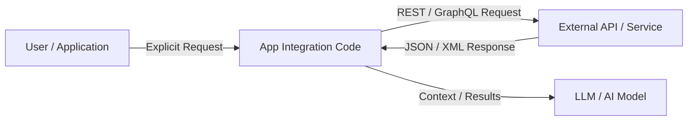

# API vs MCP (Model Context Protocol)

## Introduction

In the rapidly evolving ecosystem of Artificial Intelligence and Software Engineering, the way Large Language Models (LLMs) and AI agents interact with external data sources, tools, and environments has undergone a fundamental shift.

Traditionally, software applications communicate using **Application Programming Interfaces (APIs)**. While APIs remain the backbone of web service communication, the advent of autonomous AI agents demands a standardized, dynamic context and tool delivery protocol. This gave rise to the **Model Context Protocol (MCP)**—an open standard designed to seamlessly connect AI models with tools, data sources, and context providers.

---

## What is an API?

An **Application Programming Interface (API)** is a set of defined rules, protocols, and tools that allow one software application to interact with another. APIs define exact request structures, parameters, endpoints, data payloads, and authentication mechanisms (e.g., REST, GraphQL, gRPC).

### Key Features of APIs:
- **Rigid Contracts:** Require predefined request parameters and structured response formats (JSON/XML).
- **Developer-Centric:** Designed for software developers who hardcode integration logic into applications.
- **Stateless/Stateful RPC:** Primarily relies on request-response patterns over protocols like HTTP/HTTPS.

---

## What is MCP (Model Context Protocol)?

**Model Context Protocol (MCP)** is an open standard created to standardize how applications provide context and tools to Large Language Models (LLMs). Rather than requiring custom, ad-hoc integrations for every combination of AI model and data source, MCP provides a universal interface.

MCP enables AI models to discover available capabilities (tools, prompts, resources) dynamically and execute them in a secure, uniform manner.

### Key Features of MCP:
- **Dynamic Discovery:** LLMs can query MCP servers at runtime to inspect available tools, prompts, and data resources without hardcoding.
- **Model-Agnostic Standard:** Provides a universal communication layer between host applications (e.g., Claude Desktop, Cursor, OpenClaw) and external tools/servers.
- **Bi-directional Capability Negotiation:** Client and server negotiate capabilities (sampling, roots, resources, prompts, tools) over standardized channels (stdio, SSE).

---

## Architecture Comparison

### Traditional API Integration Architecture
In traditional API integrations, the application code manually wraps API calls, parses schema responses, handles authentication, and feeds parameters explicitly.



### Model Context Protocol (MCP) Architecture
In an MCP-enabled architecture, the AI host application connects to one or more MCP servers. The LLM dynamically inspects tools, invokes them via standardized MCP messages, and receives structured execution results.

```mermaid
graph TD
    subgraph Host Application [MCP Client / Host (e.g., Claude Desktop, Cursor)]
        LLM[LLM Engine]
        Client[MCP Client Core]
    end

    subgraph MCP Servers
        Server1[Weather MCP Server]
        Server2[Database MCP Server]
        Server3[GitHub / FileSystem MCP Server]
    end

    LLM <-->|Tool Call / Schema| Client
    Client <-->|stdio / SSE (MCP Protocol)| Server1
    Client <-->|stdio / SSE (MCP Protocol)| Server2
    Client <-->|stdio / SSE (MCP Protocol)| Server3
```

---

## Key Differences

| Feature / Aspect | Traditional API | Model Context Protocol (MCP) |
| :--- | :--- | :--- |
| **Primary Consumer** | Software Code / Developers | AI Models / Autonomous Agents |
| **Interface Discovery** | Static documentation / Swagger / OpenAPI | Dynamic runtime capability discovery |
| **Integration Complexity** | $N \times M$ custom integrations for $N$ apps & $M$ services | $N + M$ standardized connections via MCP |
| **Context Protocol** | Payload specific (REST, GraphQL, gRPC) | Standardized JSON-RPC messages (Resources, Prompts, Tools) |
| **Security & Scoping** | API Keys / OAuth per service | Granular client-managed permissions and boundaries |
| **State & Sessions** | Handled manually by client app | Built-in protocol session handshake & capability exchange |

---

## Advantages of MCP

1. **Standardized Interoperability:** Eliminates custom glue code. An MCP server created for one client (e.g., Claude Desktop) works natively in any MCP host (e.g., Cursor, OpenClaw, Multica).
2. **Dynamic Context Injection:** Provides AI models with real-time access to file systems, databases, git repositories, and web services dynamically.
3. **Decoupled Tooling:** Developers can build MCP servers independently from the host UI or model architecture.
4. **Enhanced Security:** Clients maintain control over host resources, allowing explicit user approval for tool execution and file access.

---

## Drawbacks of APIs Compared to MCP

- **High Integration Overhead:** Connecting an AI agent to 10 APIs requires writing 10 distinct wrapper scripts, prompt templates, and error handlers.
- **Lack of Standard Tool Discovery:** Traditional APIs lack a standardized protocol for LLMs to query "What tools exist and how do I format arguments?" without manual OpenAPI parsing.
- **Context Fragmentation:** Raw API responses often contain unnecessary payload bloat that consumes precious LLM context window tokens.

---

## Why MCP is Becoming the Standard for AI Agents

As AI systems evolve from basic chatbots into full-fledged autonomous agents capable of performing complex multi-step workflows, standardized interaction layers are critical.

### Key Drivers:
- **Ecosystem Adoption:** Leading developer environments and AI platforms—such as **Claude Desktop**, **Cursor**, **OpenClaw**, and **Multica**—have adopted MCP natively.
- **Rich Ecosystem of MCP Servers:** Community and enterprise providers build modular MCP servers for GitHub, PostgreSQL, Slack, Brave Search, and local filesystem access.
- **Reduced Friction:** Developers can attach powerful capabilities to their AI tools instantly using open MCP servers without writing custom integration code.

---

## Real-World Examples

1. **Local System Management:** An MCP server providing secure local file manipulation or terminal execution to **Cursor** or **Claude Desktop**.
2. **Enterprise Knowledge Access:** An internal MCP server bridging enterprise databases (e.g., Snowflake, PostgreSQL) to AI assistants with role-based context retrieval.
3. **Multi-Agent Orchestration:** Platforms like **OpenClaw** and **Multica** leveraging MCP servers to execute complex multi-step automation tasks seamlessly.

---

## Conclusion

While APIs remain indispensable for application-to-application communication, **Model Context Protocol (MCP)** represents a paradigm shift for AI-to-environment interaction. By replacing fragmented, custom API wrappers with a unified, standard context protocol, MCP empowers AI agents to become more capable, secure, and versatile.
